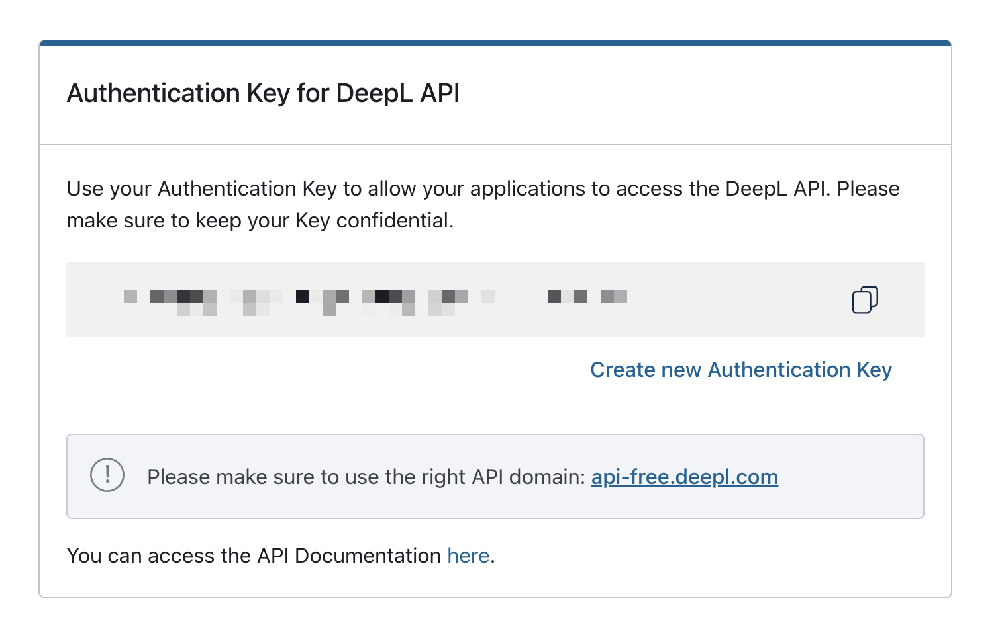
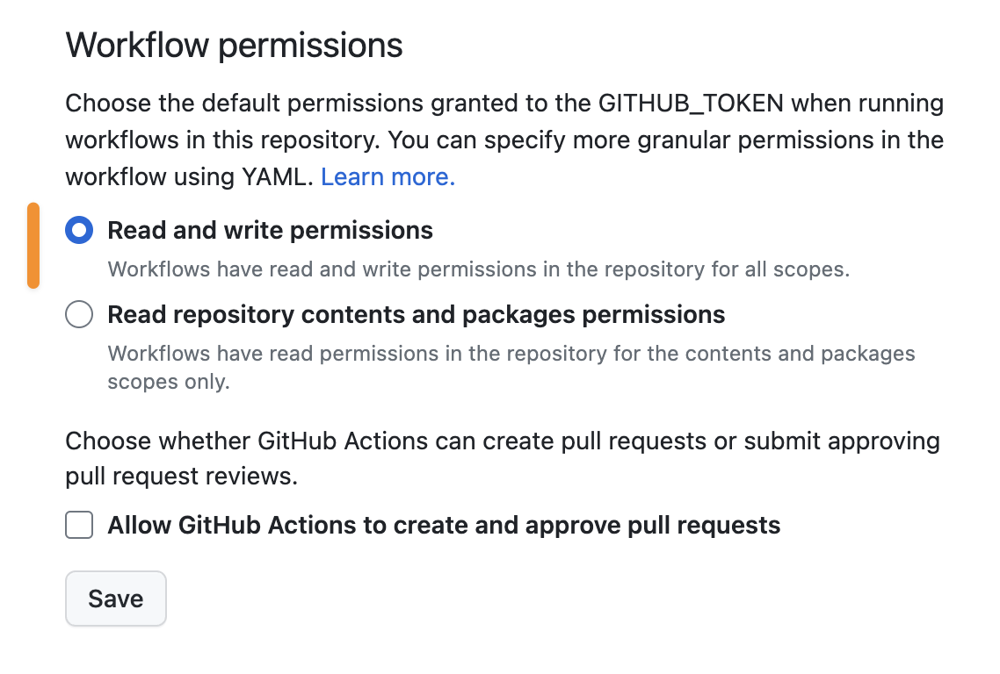

# DeepL Translate Github Action

> 🏆 v1.0.0 of this github action was awarded the [Grand Prize of Maintainer must-haves category in the GitHub + DEV 2023 Hackathon](https://dev.to/devteam/github-dev-2023-hackathon-winners-announced-236o)

## Intro

This action uses the [DeepL Translate API](https://github.com/DeepLcom/deepl-node) to translate files in your repository to any target languages supported by DeepL. 
Since DeepL API does not officially support markdown tag handling yet, this github action helps to mitigate some issues that DeepL may have when it comes to `.md` documents.

✨ In v1.0.0, **common text files** such as `.md | .html | .xml | .txt` are supported.

✨ From v2.0.0 onwards, flat **locale JSON** files are also supported.

✨ From v2.1.0 onwards, nested **locale JSON** files are also supported.

## Inputs

| Name                       | Description                                                                                                                                                                                       | Required |
| -------------------------- | ------------------------------------------------------------------------------------------------------------------------------------------------------------------------------------------------- | :------: |
| `deepl_api_key`            | API Key for DeepL API                                                                                                                                                                             |   yes    |
| `target_languages`         | Target languages to translate to. Refer to [DeepL docs for language codes](https://www.deepl.com/docs-api/translate-text). You can also input `all` for all target languages that DeepL supports. |   yes    |
| `input_file_path`          | Path of the file you want to translate. Accepts `.html, .xml, .md, .txt, .json`                                                                                                                   |   yes    |
| `output_file_name_pattern` | Output file name pattern. e.g: `public/locales/{language}/common.json` where language is replaced by the target language code                                                                  |    yes    |
| `no_translate_start_tag`   | Start tag to ignore when translating in the case of HTML-like files such as `.html, .xml, .md, .txt`                                                                                                    |    no    |
| `no_translate_end_tag`     | End tag to ignore when translating in the case of HTML-like files such as `.html, .xml, .md, .txt`.                                                                                                     |    no    |

## Example usage

### For standard text files such as `.md`, `.html`, `.xml`, `.txt`

```yaml
name: Translate documents from docs/simple folder
on:
  workflow_dispatch:
  pull_request:
    types: [opened, synchronize]

jobs:
  build:
    runs-on: ubuntu-latest
    steps:
      - name: DeepL Translate Github Action
        uses: lyqht/deepl-translate-github-action@v2.0.0
        with:
          target_languages: zh,ja
          input_file_path: docs/simple/original.md
          output_file_name_pattern: docs/simple/{language}.md
          deepl_api_key: ${{ secrets.DEEPL_API_KEY }}
```

With this workflow, you will get `docs/simple/zh.md` and `docs/simple/ja.md`

### For locale json

```yaml
name: Translate locales json
on:
  workflow_dispatch:
  pull_request:
    types: [opened, synchronize]

jobs:
  build:
    runs-on: ubuntu-latest
    steps:
      - name: DeepL Translate Github Action
        uses: lyqht/deepl-translate-github-action@v2.1.0
        with:
          target_languages: fr,ja
          input_file_path: locales/en.json
          output_file_name_pattern: locales/{language}.json
          deepl_api_key: ${{ secrets.DEEPL_API_KEY }}
```

With this workflow, you will get `locales/fr.json`, `locales/ja.json`.

## Demo

- For a simple demo of translating HTML-like text files, refer to the [deepl-demo](https://github.com/lyqht/deepl-demo) repository.
- For a more advanced demo of translating both the `README.md` and `locale/x.json`, refer to [nuxt3-app-vue-i18n](https://github.com/lyqht/nuxt3-app-vue-i18n) repository, with a deployed app.

When the github action runs, it will produce commits like the following based on your input paths.


### For nested locale JSON

```yaml
name: Translate locale commons json
on:
  workflow_dispatch:
  pull_request:
    types: [opened, synchronize]

jobs:
  build:
    runs-on: ubuntu-latest
    steps:
      - name: DeepL Translate Github Action
        uses: lyqht/deepl-translate-github-action@v2.1.0
        with:
          target_languages: fr,ja
          input_file_path: public/locales/en/common.json
          output_file_name_pattern: public/locales/{language}/common.json
          deepl_api_key: ${{ secrets.DEEPL_API_KEY }}
```

With this workflow, you will get `public/locales/fr/common.json`, `public/locales/ja/common.json`.

For a demo, refer to [refine-i18n-react](https://github.com/lyqht/refine-i18n-react) repository, with a deployed app.

## FAQ

<details><summary>How to get DeepL API Token</summary>

First, you need to [sign up for the free DeepL API plan](https://www.deepl.com/docs-api). Then you can go to https://www.deepl.com/account/summary and retrieve your token there.



</details>

<details><summary>If you don't have an existing GitHub Action workflow for your repository</summary>

1. Create a folder `.github/workflows` if you don't have it already
2. Inside that folder, create a YAML file say `translate.yml`
3. In the `translate.yml` file, you can copy the example below and modify it to your usage.
</details>

<details><summary>Why am I getting an error of "Permission to git denied to github-actions[bot]"</summary>

You have to set the workflow permissions under Repository Settings > Actions > Workflow permissions to be **"Read and write permissions"**.



</details>

<details><summary>The script is cool but I don't want to use a GitHub action. Can I run it locally?</summary>

Well, you're in luck! Refer to `local.ts` and modify your env variables accordingly.

</details>
